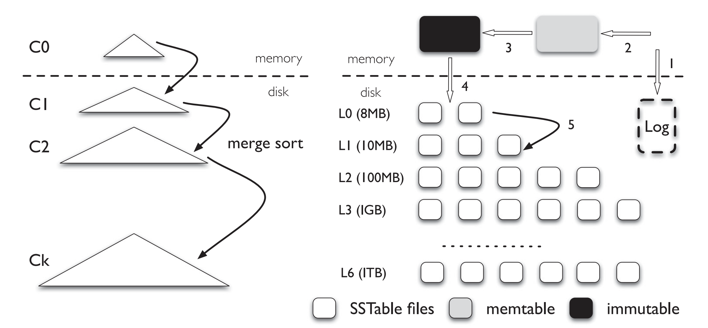

# leveldb-rust

This is a experimental implementation of [LevelDB](https://github.com/google/leveldb) in Rust. It is not production ready. It is not even feature complete. It is just a toy project to learn Rust.

## Architecture

LevelDB is a key-value store. It stores data in a log-structured merge-tree (LSM-tree). The LSM-tree is a disk-based data structure that consists of a sequence of levels. Each level is a sorted table.

## Data Structure
### Slice
Slice is a basic data structure in LevelDB. It is a wrapper of a byte array. It is used to represent a key or a value.
